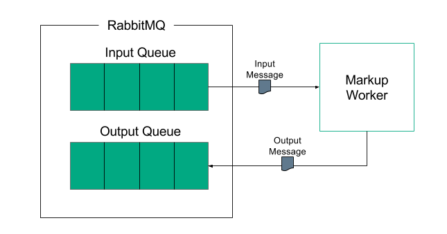

# Markup Worker

The Markup Worker is used to identify elements within a document or e-mail. For example, given an e-mail thread the Markup Worker is able to identify the individual e-mails that make up the thread and to mark these up (using xml markup tags). It can recognise individual headers and other elements of the e-mail and similarly mark them up for further processing. In addition to its recognition capabilities the Markup Worker is also able to apply normalisations against data and to generate hash digests, in order to help with comparing the data. Ultimately these facilities can be combined to identify related e-mails, such as replied-to and forwarded e-mails, thereby allowing e-mails to be organised into a conversation tree.

The Markup Worker reads messages from a configured input queue. The messages are encoded using JSON and each one contains metadata about the document to be processed. The metadata values are passed using `ReferencedData` objects, which means that they may be passed by value (i.e. directly within the message) or by reference (i.e. where the message contains a location in central storage which contains the value). As well as the document metadata, each message may also contain additional information about the request, such as how the client would like hashes to be generated, and what information they would like to see returned.

#### E-mail Markup
When used with e-mails, the worker splits e-mails in the e-mail thread, identifies metadata such as headers and body content, and marks up the text with XML. Hash values will be generated based on the user supplied configuration on a per-task basis and added to the marked up document. The worker will extract values from the XML document based on user defined output field names and XPath expressions. It then returns these field names and values as a list of name-value pairs.

For more details about the Markup Worker, a general overview of its operation and configuration, visit [Markup Worker API](markup-worker.md).

## Modules

### worker-markup-shared
This is the shared library defining public classes that constitute the worker interface to be used by consumers of the Markup Worker. The project can be found in [worker-markup-shared](worker-markup-shared).

### worker-markup
This project contains the entry point of the Markup Worker. It can be found in [worker-markup](worker-markup).

### worker-markup-core
This project contains the actual logic and implementation of the Markup Worker. It can be found in [worker-markup-core](worker-markup-core).

### worker-markup-container
This project builds a Docker image that packages the Markup Worker for deployment. It can be found in [worker-markup-container](worker-markup-container).

### worker-markup-testing
This contains implementations of the testing framework to allow for integration testing of the Markup Worker. The project can be found in [worker-markup-testing](worker-markup-testing)

## Feature Testing
The testing for the Markup Worker is defined in [testcases](worker-markup-container-fs/testcases).
